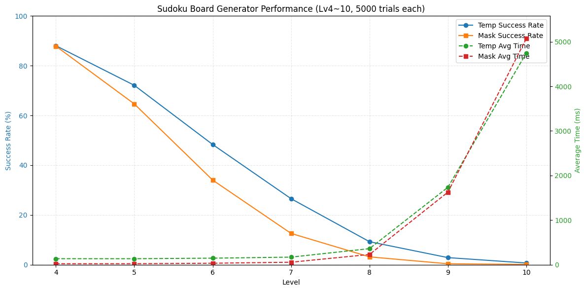

# Sudoku Board Generator Performance Analysis (Lv4~10)

본 자료는 Temp 방식과 Mask 방식을 비교하여 난이도별 성능을 분석한 결과입니다.  
총 시행횟수는 각 난이도별 **5000회**로 통일했습니다.
(500회씩 교차 시행)

| Level | Temp Total Boards | Temp Avg Time (ms) | Temp Success Rate (%) | Mask Total Boards | Mask Avg Time (ms) | Mask Success Rate (%) |
|-------|-----------------|-----------------|---------------------|-----------------|-----------------|---------------------|
| 4     | 4402            | 135.17          | 88.0                | 4393            | 21.67           | 87.9                |
| 5     | 3606            | 134.74          | 72.1                | 3232            | 22.57           | 64.6                |
| 6     | 2416            | 147.00          | 48.3                | 1701            | 33.35           | 34.0                |
| 7     | 1327            | 170.28          | 26.5                | 629             | 56.14           | 12.6                |
| 8     | 463             | 361.17          | 9.3                 | 158             | 230.08          | 3.2                 |
| 9     | 143             | 1736.06         | 2.9                 | 19              | 1627.25         | 0.4                 |
| 10    | 35              | 4746.66         | 0.7                 | 6               | 5071.22         | 0.1                 |

---

## 분석 요약

- **낮은 난이도(Lv4~5)**: Mask 방식이 Temp보다 훨씬 빠르며, 생성률도 거의 동일
- **중간 난이도(Lv6~7)**: Mask 방식의 생성률 급격히 감소, 성공 보드 수가 Temp의 절반 이하
- **높은 난이도(Lv8~10)**: Mask 방식은 거의 보드 생성 불가, Temp 방식이 안정적이지만 평균 시간 증가

**결론:** Mask 방식은 낮은 난이도 최적화용이며, Lv6 이상부터는 Temp 방식이 안정적이며 재현성이 높음.

