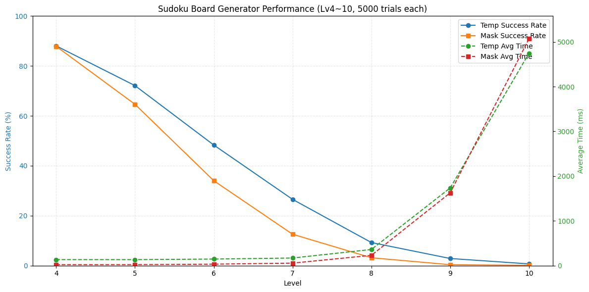
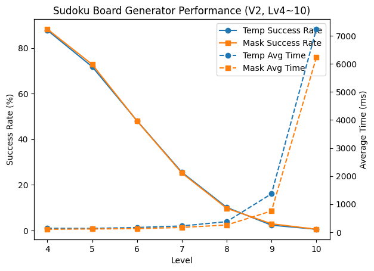

# Sudoku Board Generator Performance Analysis (Lv4~10)
본 자료는 Temp 방식과 Mask 방식을 비교하여 난이도별 성능을 분석한 결과입니다.  
총 시행횟수는 각 난이도별 **5000회**로 통일했습니다.
(500회씩 교차 시행)

## 목표
- 메모리구조 및 연산과정을 비트마스크를 활용하여 생성속도 개선

## 결과

- 동일한 생성 품질을 유지하면서도 평균 약 25%의 성능 개선을 달성했으며, 일부 고난이도 구간에서는 최대 44%까지 속도 향상을 확인
- 빠른 연산을 통해 생성 속도를 향상시키기는 했으나, 경우의 수 분기 자체를 줄여 탐색 구조를 줄이는 MRV 방식도 고려해봐야 할 듯함

# 1차 실험

- 조건
  - 비트연산의 빠름을 최대화 하여 속도만 개선해보기
  - 무작위성을 고려하여 unique한 board를 확정 짓기 위한 검증 과정에서 사용한 list(숫자 배열)을 shuffle 하는 과정을 배제함

| Level | Temp Total Boards | Temp Avg Time (ms) | Temp Success Rate (%) | Mask Total Boards | Mask Avg Time (ms) | Mask Success Rate (%) |
|-------|-----------------|-----------------|---------------------|-----------------|-----------------|---------------------|
| 4     | 4402            | 135.17          | 88.0                | 4393            | 21.67           | 87.9                |
| 5     | 3606            | 134.74          | 72.1                | 3232            | 22.57           | 64.6                |
| 6     | 2416            | 147.00          | 48.3                | 1701            | 33.35           | 34.0                |
| 7     | 1327            | 170.28          | 26.5                | 629             | 56.14           | 12.6                |
| 8     | 463             | 361.17          | 9.3                 | 158             | 230.08          | 3.2                 |
| 9     | 143             | 1736.06         | 2.9                 | 19              | 1627.25         | 0.4                 |
| 10    | 35              | 4746.66         | 0.7                 | 6               | 5071.22         | 0.1                 |

---

## 분석 요약

- **낮은 난이도(Lv4~5)**: Mask 방식이 Temp보다 훨씬 빠르며, 생성률도 거의 동일
- **중간 난이도(Lv6~7)**: Mask 방식의 생성률 급격히 감소, 성공 보드 수가 Temp의 절반 이하
- **높은 난이도(Lv8~10)**: Mask 방식은 거의 보드 생성 불가, Temp 방식이 안정적이지만 평균 시간 증가

**결론:** Mask 방식은 낮은 난이도 최적화용이며, Lv6 이상부터는 Temp 방식이 안정적이며 재현성이 높음.

## 1차 실험 분석 요약 및 결론 수정

- 현상: 난이도가 높아질수록(Lv 6 이상) Mask 방식의 생성률이 Temp 대비 최대 10배 이상 급락하며, 고난이도 보드 생성에 실패함.
- 원인 분석:
  - 무작위성(Entropy) 부족: Mask 방식의 속도를 극대화하기 위해 재귀 호출 시 숫자 배열(list)을 셔플하는 과정을 생략함.
  - 이로 인해 생성된 보드가 논리적으로 단조로운 구조를 갖게 되었고, 칸을 많이 지우는 고난이도 작업에서 '유일 해답'을 유지하지 못하고 파괴됨.
  - 결과적으로 검증 단계에서 대다수의 보드가 탈락하며 생성 효율이 저하됨.  

**새로운 결론:**
1차 실험에서 나타난 Mask 방식의 생성률 저하는 알고리즘 자체의 결함이 아닌, 속도 최적화를 위해 무작위성(Shuffle)을 배제한 조건 차이에서 기인함. Mask 방식은 낮은 난이도뿐만 아니라 전 구간에서 잠재력이 있으나, 고난이도 생존력을 위해선 Temp 방식과 동일한 수준의 무작위성 확보가 필수적임.  

--- 

# 2차 실험

- 조건
  - 기존 temp 방식이 무작위성을 지닌 충분한 puzzle 생성기라고 판단됨
  - 점진적 성능 향상을 위해 temp와 동일한 조건으로 진행

## 📊 Performance Benchmark (V2)

| Level | Temp Total Boards | Temp Avg Time (ms) | Temp Success Rate (%) | Mask Total Boards | Mask Avg Time (ms) | Mask Success Rate (%) |
|-------|------------------|--------------------|------------------------|-------------------|--------------------|------------------------|
| 4     | 4392             | 138.36             | 87.8%                  | 4418              | 105.47             | 88.3%                  |
| 5     | 3594             | 134.48             | 71.8%                  | 3643              | 116.53             | 72.8%                  |
| 6     | 2403             | 168.72             | 48.1%                  | 2400              | 127.64             | 48.0%                  |
| 7     | 1277             | 223.30             | 25.5%                  | 1259              | 170.72             | 25.2%                  |
| 8     | 505              | 376.68             | 10.1%                  | 485               | 257.23             | 9.7%                   |
| 9     | 117              | 1369.32            | 2.3%                   | 146               | 756.94             | 2.9%                   |
| 10    | 24               | 7235.51            | 0.5%                   | 23                | 6228.02            | 0.5%                   |

### 1. 생성 품질 개선 (Success Rate)
- Mask 방식의 무작위성(Entropy)을 보완하여  
  고난이도(Level 7~10)에서 Temp 방식과 **동등한 수준의 성공률 확보**
- 기존 Mask 방식의 약점이었던 **고난이도 생성 실패 문제 해결**

---

### 2. 성능 개선 (Speed)

| Level | 성능 향상률 |
|-------|------------|
| 4     | 23.8%      |
| 5     | 13.3%      |
| 6     | 24.3%      |
| 7     | 23.5%      |
| 8     | 31.7%      |
| 9     | 44.7%      |
| 10    | 13.9%      |

- 전 구간 평균 약 **~25% 속도 향상**
- 특히 고난이도(Level 8~9)에서 **최대 44% 성능 개선**
- 비트 연산 기반 검증 로직 최적화가 주요 원인

---

### 3. 핵심 결론

- **속도:** Mask 방식이 전 구간 우위
- **품질:** Temp 방식과 동등 수준 확보
- 👉 **Mask V2 = 속도 + 품질 모두 잡은 최적의 생성 전략**

---

